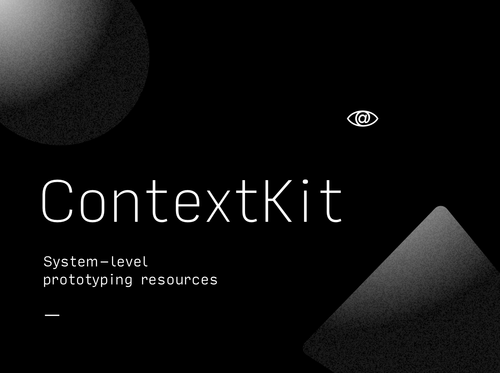

# ContextKit
System-level prototyping resources. Designed to add context to your prototypes.

## Compatibility
Origami Studio-only for now.

## Documentation
Detailed information on each component's inputs and outputs is available inside its respective tool's directory. So far, information is available for:
- [iOS Notification component for Origami](origami/notification.md)
- [iOS SpringBoard App component for Origami](origami/springboard-app.md)
